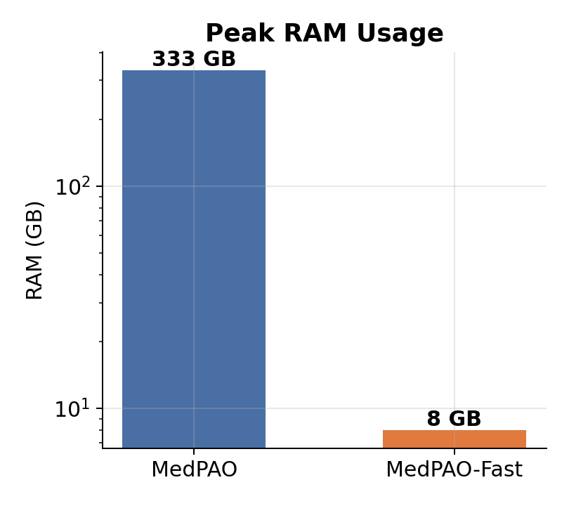
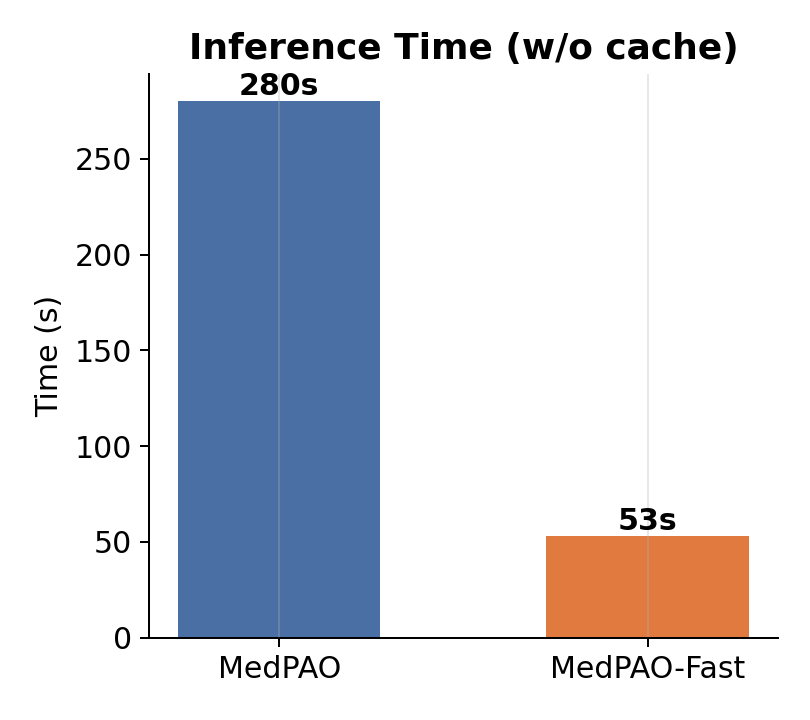
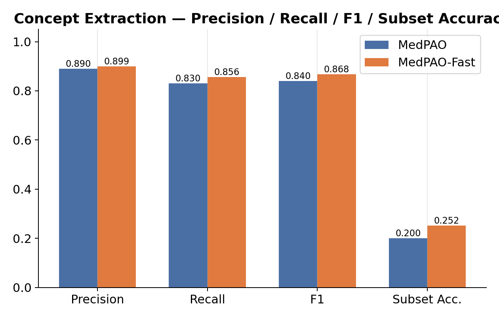
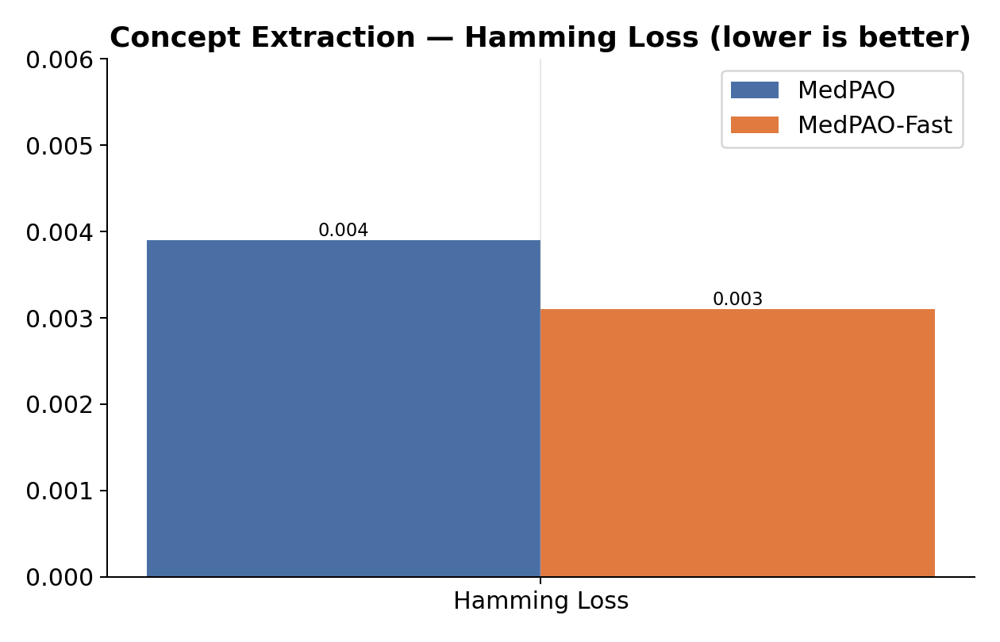
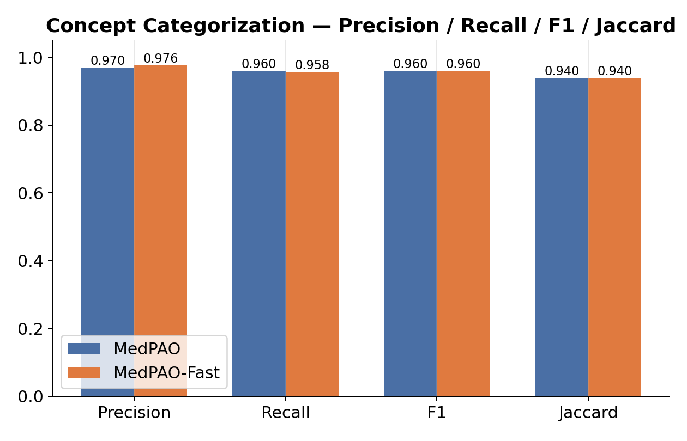

<div align="center">

# 🫁 MedPAO-Fast

### A Fast, Protocol-Driven Agent for Structuring Chest X-Ray Reports

[](https://python.org)
[](https://huggingface.co/Qwen/Qwen3-4B-Instruct-2507)
[](https://langchain-ai.github.io/langgraph/)
[](https://doi.org/10.1007/978-3-032-06004-4_4)
[](https://huggingface.co/shrishSVaidya/medpao-fast-models)

<br/>

*MedPAO-Fast turns free-text chest X-ray reports into a structured, protocol-grounded ABCDEF report — running entirely on a single low-end GPU, using a 4-bit quantized base model and hot-swappable LoRA adapters instead of a 70B orchestrator.*

</div>

---

## 📌 Overview

Chest X-ray review is routinely taught and audited using the **ABCDEF protocol** — Airways, Breathing, Circulation, Diaphragm (and below), External, Foreign material. Getting an LLM to produce a report that is faithful to this protocol, rather than a free-form paraphrase, requires grounding every generated statement in concepts actually extracted from the source report.

**MedPAO-Fast** is a LangGraph agent that does exactly this: it extracts medical concepts from a report, grounds each one in a SNOMED CT ontology entry, classifies it into the correct PABCDEF bucket, and synthesizes a final structured report — all through a transparent, inspectable Plan → Act → Observe loop rather than a single opaque generation call.

It is the faster, lighter successor to an earlier **MedPAO** pipeline (published at *Agentic AI for Medicine Workshop @ MICCAI 2025*, Springer, 2026 — see [Citation](#-citation)), which orchestrated with a DeepSeek-R1 (70B) model plus a separately finetuned MedLLaMA (7B), and relied on a Levenshtein-distance API for ontology mapping. MedPAO-Fast replaces all of that with a single quantized Qwen3-4B model driving finetuned LoRA adapters as its toolset, and a local embedding-based SNOMED matcher — see [Results](#-results) for the resulting speed/memory tradeoffs and [Challenges & Solutions](#-challenges--solutions) for what motivated each change.

---

## 🏗️ Architecture: The Plan → Act → Observe Loop

```
                     Free-text Radiology Report
                                │
                                ▼
                   ┌─────────────────────────┐
                   │         Planner          │  Base Qwen3-4B (no adapter)
                   │  picks which modules to  │  → dynamic module queue
                   │      run, in order       │
                   └─────────────┬─────────────┘
                                │
                                ▼
                   ┌─────────────────────────┐
                   │       get_concept         │  LoRA: get_concept
                   │  extract concepts + their │
                   │      source sentence      │
                   └─────────────┬─────────────┘
                                │
                                ▼
                   ┌─────────────────────────┐
                   │       check_cache          │  local JSON vocab cache
                   │  skip re-mapping concepts  │
                   │      already seen before   │
                   └─────────────┬─────────────┘
                                │
                                ▼
                   ┌─────────────────────────┐
                   │     ontology_mapping        │  SapBERT + SNOMED CT index
                   │  ground concepts in a real   │
                   │       ontology entry          │
                   └─────────────┬─────────────┘
                                │
                                ▼
                   ┌─────────────────────────┐
                   │    categorize_concepts       │  LoRA: concept_categorizer_multi
                   │  assign each concept to A /   │
                   │      B / C / D / E / F         │
                   └─────────────┬─────────────┘
                                │
                                ▼
                   ┌─────────────────────────┐
                   │ generate_structured_report   │  Base Qwen3-4B (no adapter)
                   │  synthesize the final PABCDEF │
                   │            report              │
                   └─────────────┬─────────────┘
                                │
                                ▼
                      Structured PABCDEF Report
```

The compiled graph is exposed as `full_agent` in `langgraph_agent.py` and consumed by both the Gradio demo and the batch runner. The planner reads the report and user query, decides which modules are actually needed, and routes the state through only those — so a query like *"map these concepts to ontologies"* can skip straight to `ontology_mapping` instead of running the full pipeline.

---

## ⚡ LoRA Hot-Swapping on a Single Base Model

Instead of loading separate finetuned models per task, MedPAO-Fast loads **one** 4-bit NF4-quantized Qwen3-4B-Instruct base model and hot-swaps two lightweight LoRA adapters onto it via `peft`:

- **`get_concept`** — concept extraction + source-sentence mapping
- **`concept_categorizer_multi`** — multi-input ABCDEF categorization

The planner and report-generation steps run the **base model with adapters disabled**; the extraction step swaps in its adapter with `model.set_adapter(...)` before generating. Everything lives inside a single set of base-model weights instead of juggling multiple full checkpoints.

**Benefits:**
- 🖥️ **Low memory footprint** — the full pipeline runs within ~8 GB peak RAM (vs. 333 GB for the DeepSeek-R1-based MedPAO predecessor)
- 🧩 **One model, not two** — no need for a separately finetuned second model (MedPAO required a finetuned MedLLaMA 7B alongside DeepSeek-R1)
- 🏥 **Edge-ready** — deployable on a single low-end GPU instead of an HPU cluster

---

## 🛠️ Technical Stack

| Component | Technology |
|---|---|
| Foundation model | `Qwen/Qwen3-4B-Instruct-2507`, 4-bit NF4 quantized |
| Adapter fine-tuning | LoRA via `peft` (`bitsandbytes` for quantization) |
| Agentic orchestration | LangGraph `StateGraph` |
| Ontology grounding | SapBERT (`cambridgeltl/SapBERT-from-PubMedBERT-fulltext`) + local SNOMED CT embedding index (L2 similarity) |
| UI | Gradio |
| Evaluation | `rapidfuzz` fuzzy concept matching + `scikit-learn` metrics, optional Weights & Biases logging |

---

## 📁 Repository Structure

```
medpao-fast/
│
├── langgraph_agent.py     # Core LangGraph agent: model/adapter loading, planner, tool nodes (`full_agent`)
├── ontoology_mapping.py   # SnomedMatcher — SapBERT embedding index lookup for ontology grounding
├── gradio_ui.py           # Interactive Gradio web app for the full pipeline
├── agent_batched.py       # CLI batch runner over a ground-truth dataset → predictions JSON
├── evaluate_abcde.py      # Fuzzy concept-categorization evaluation vs. ground truth (+ optional W&B)
├── assets/                # Result charts used in this README
└── README.md
```

---

## 📈 Results

Benchmarked against the earlier MedPAO pipeline (DeepSeek-R1 70B orchestrator) on the same chest X-ray report set.

*Note: All the experiments of current MedPAO-Fast have been computed on Nvidia Titan XP GPU.*

### Efficiency

<p float="left">
  
  
</p>

| | Peak RAM Usage (GB) | Inference Time, no cache (s) |
|---|---|---|
| MedPAO | 333 | 280 |
| MedPAO-Fast | 8 | 53 |

MedPAO-Fast uses **~42x less peak RAM** and runs **~5.3x faster** per report with no cache hits.

### Concept extraction





### Concept categorization




Despite the much smaller footprint, MedPAO-Fast matches or slightly exceeds MedPAO on every extraction and categorization metric.

---

## 🧩 Challenges & Solutions

| Challenge in MedPAO | Solution in MedPAO-Fast |
|---|---|
| Orchestrator was DeepSeek-R1 (70B) — induced high decoding time | Replaced orchestrator with Qwen3 (4B) — reduced decoding time |
| DeepSeek-R1 required a much higher RAM footprint | With Qwen3 (4B), MedPAO-Fast needs ~50x less RAM |
| Needed both DeepSeek-R1 and a separately finetuned MedLLaMA (7B) | Qwen3 is the single orchestrator, with finetuned LoRA adapters as its toolset |
| Relied on an external API for ontology mapping, based on Levenshtein distance | Uses an embedding-based (SapBERT) L2 similarity search for ontology mapping |
| No quantization | NF4 quantization |
| Tested on HPU | Tested on a low-end GPU |

---

## 🚀 Quickstart

### 1. Install dependencies

```bash
pip install torch transformers peft bitsandbytes accelerate \
            langgraph gradio \
            numpy pandas matplotlib seaborn scikit-learn rapidfuzz tqdm \
            wandb huggingface_hub
```


### 2. LoRA adapters — nothing to download manually

Both adapters are published at **[huggingface.co/shrishSVaidya/medpao-fast-models](https://huggingface.co/shrishSVaidya/medpao-fast-models)**:

| Adapter | Task | 
|---|---|
| `get_concept` | Concept extraction | 
| `concept_categorizer_multi` | ABCDEF categorization | 

Download the model from huggingface via:
```
pip install -U huggingface_hub

```

```
hf download shrishSVaidya/medpao-fast-models \
    --local-dir ./medpao-fast-models
```

`langgraph_agent.py` is the main code consisting of entire MedPAO-Fast agent. Following varibales need to be set in it:

| var |Purpose |
|---|---|
| `HF_HOME` |  Where models/adapters are cached |
| `CONC_EXTRACTOR_PATH` | Subfolder for the concept-extraction adapter |
| `CONC_CATEGORIZER_PATH` |  Subfolder for the categorization adapter |


### 3. Provide a SNOMED CT index

`ontoology_mapping.py` expects a prebuilt embedding index at `./snomed_index/` (`snomed_embeddings.npy` + `snomed_metadata.jsonl`), or wherever `SNOMED_INDEX_DIR` points. This index is separate from the two LoRA adapters above and must be built/obtained ahead of time.

### 4. Run it

**Interactive demo (Gradio):**

```bash
python gradio_ui.py
```

Opens a local web UI (default `http://0.0.0.0:7860`, `share=True` by default). Override with `GRADIO_SERVER_NAME`, `GRADIO_SERVER_PORT`, `GRADIO_SHARE=false` as needed.

**Batch inference over a dataset:**

```bash
python agent_batched.py \
  --gt-path Final_gt.json \
  --output-path predicted_multi_input_grpo.json \
  --limit 50   # optional smoke test
```

`Final_gt.json` should be a list of records containing an `id` and a `report` field (override key names with `--id-key` / `--report-key`). Output is a JSON list with extracted concepts, categorized concepts, and the final structured report per sample.

**Evaluate predictions against ground truth:**

```bash
python evaluate_abcde.py \
  --gt-path Final_gt.json \
  --pred-path predicted_multi_input_grpo.json \
  --wandb-project qwen3-medical-extraction \
  --wandb-run-name my-eval-run \
  --output-dir ./eval_outputs
```

Add `--no-wandb` to skip experiment tracking, or run `python evaluate_abcde.py --help` for the full list of options.

---

## 📝 Citation

If you use MedPAO-Fast in your work, please cite the original MedPAO paper this pipeline builds on:

```bibtex
@InProceedings{10.1007/978-3-032-06004-4_4,
author="Vaidya, Shrish Shrinath
and Palani, Gowthamaan
and Ramesh, Sidharth
and Balasubramanian, Velmurugan
and Selvam, Minmini
and Srinivasaraja, Gokulraja
and Krishnamurthi, Ganapathy",
editor="Qiu, Jianing
and Wu, Jinlin
and Langlotz, Curtis
and Huang, Baoru
and Lei, Zhen
and Wu, Honghan
and Liu, Hongbin
and Xie, Weidi",
title="MedPAO: A Protocol-Driven Agent for Structuring Medical Reports",
booktitle="AI for Clinical Applications",
year="2026",
publisher="Springer Nature Switzerland",
address="Cham",
pages="33--45",
abstract="The deployment of Large Language Models (LLMs) for structuring clinical data is critically hindered by their tendency to hallucinate facts and their inability to follow domain-specific rules. To address this, we introduce MedPAO, a novel agentic framework that ensures accuracy and verifiable reasoning by grounding its operation in established clinical protocols such as the ABCDEF protocol for CXR analysis. MedPAO decomposes the report structuring task into a transparent process managed by a Plan-Act-Observe (PAO) loop and specialized tools. This protocol-driven method provides a verifiable alternative to opaque, monolithic models. The efficacy of our approach is demonstrated through rigorous evaluation: MedPAO achieves an F1-score of 0.96 on the critical sub-task of concept categorization. Notably, expert radiologists and clinicians rated the final structured outputs with an average score of 4.52 out of 5, indicating a level of reliability that surpasses baseline approaches relying solely on LLM-based foundation models. The code is available at: https://github.com/MiRL-IITM/medpao-agent.",
isbn="978-3-032-06004-4"
}
```

<div align="center">

Built at the **Medical Imaging & Reconstruction Lab (MiRL)**.

</div>